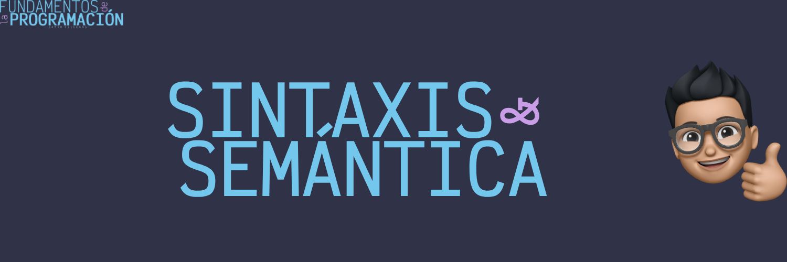

# Sintaxis y semántica de un lenguaje de programación

La sintaxis y semántica son pilares fundamentales en la construcción de programas. Al igual que la gramática y el significado de las palabras en un lenguaje natural, estos conceptos definen la estructura y el significado del código fuente.

## Sintaxis, la estructura del lenguaje

La sintaxis se refiere al conjunto de reglas que gobiernan la estructura formal de un programa. Estas reglas incluyen la forma en que se escriben las instrucciones, la manera en que se combinan las palabras clave y los símbolos, y la forma en que se organizan los bloques de código.

- **Palabras clave**: Términos reservados con un significado específico en el lenguaje de programación. Por ejemplo, `if`, `else`, `for`, `while`, `return`, entre otros.

- **Identificadores**: Nombres asignados a variables, funciones y otros elementos del programa. Deben seguir ciertas reglas de formato y no pueden coincidir con las palabras clave.

- **Operadores**: Símbolos que realizan operaciones (aritméticas, lógicas, de comparación, etc.) entre variables y valores. Por ejemplo, `+`, `-`, `*`, `/`, `==`, `!=`, `&&`, `||`, entre otros.

- **Delimitadores**: Caracteres que marcan el inicio y final de bloques de código, como llaves `{}`, paréntesis `()`, corchetes `[]`, comas `,`, punto y coma `;`, entre otros.

- **Estructura**: La disposición física del código, como la indentación y la colocación de llaves, que afecta a la interpretación del programa.

La sintaxis es esencial para que el compilador o intérprete puede analizar y comprender el código. Un error de sintaxis impide que el programa se ejecute correctamente.

## Semántica, el significado del lenguaje

La semántica se ocupa del significado de las construcciones del lenguaje. es decir, determina cómo se interpretan y ejecutan las instrucciones. La semántica está estrechamente relacionada con la lógica y la matemática.

Algunos aspectos clave de la semántica incluyen:

- **Tipos de datos**: Definen el conjunto de valores que puede tomar una variable (enteros, flotantes, cadenas, booleanos, etc.).

- **Expresiones**: Combinaciones de operadores, variables y constantes que producen un valor.

- **Declaraciones**: Instrucciones que modifican el estado del programa (asignaciones, llamadas a funciones, etc.).

- **Control de flujo**: Mecanismos para alterar la secuencia de ejecución del programa (condicionales, bucles, saltos, etc.).

La semántica garantiza que el programa realice las operaciones correctas y produzca los resultados esperados.