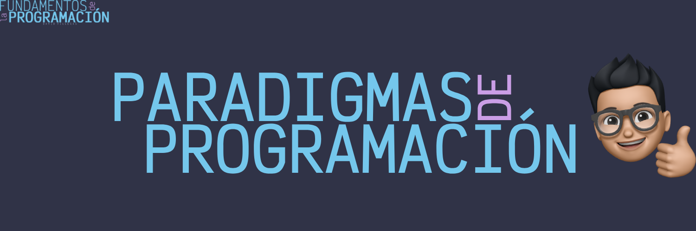

# Paradigmas de programación

Los paradigmas de programación representan enfoques fundamentales y distintos para la concepción, diseño y estructuración de programas. Cada paradigma ofrece una perspectiva única sobre la resolución de problemas computacionales, influyendo en la elección de estructuras de control, tipos de datos y estilos de programación.

## Clasificación de los paradigmas de programación

Los paradigmas de programación pueden clasificarse en diversas categorías, dependiendo de sus características y principios fundamentales. A continuación, se presentan los paradigmas más comunes:

### Programación imperativa

Se centra en la descripción detallada de los pasos que debe seguir un programa para alcanzar un objetivo. Utiliza instrucciones secuenciales, condicionales y repetitivas para controlar el flujo de ejecución.

- **Estructurada**: Se enfoca en la modificación secuencial del estado de un programa a través de instrucciones explícitas. Emplea estructuras de control como `if`, `else`, `while` y `for`.

- **Orientada a objetos**: Organiza el código en torno a objetos que encapsulan datos y comportamientos. Permite la reutilización y la extensión de código a través de la herencia y el polimorfismo.

- **Procedural**: Divide un programa en procedimientos o funciones independientes que realizan tareas específicas. Facilita la Modularidad y la depuración del código.

### Programación declarativa

Se enfoca en la descripción de la lógica y las restricciones del problema, en lugar de los pasos para resolverlo. Utiliza expresiones y reglas lógicas para definir la solución deseada.

- **Funcional**: Trata la computación como la evaluación de funciones matemáticas puras, sin efectos secundarios. Se basa en la aplicación de funciones y la inmutabilidad de los datos.

- **Lógica**: Se basa en la lógica formal y las reglas de inferencia para representar el conocimiento y las relaciones entre los datos. Utiliza la programación lógica y la resolución de problemas mediante la inferencia.

## Selección de paradigmas de programación

La elección del paradigma de programación adecuado depende de varios factores, como la naturaleza del problema, los requisitos del sistema y las preferencias del programador. A continuación, se presentan algunas consideraciones importantes:

- **Naturalidad del problema**: Algunos problemas se modelan de manera más natural en un paradigma específico. Por ejemplo, los problemas matemáticos suelen abordarse de manera más efectiva con programación funcional.

- **Herramientas disponibles**: La elección de un paradigma puede estar influenciada por las herramientas y bibliotecas disponibles en un lenguaje de programación específico. Algunos lenguajes están diseñados para un paradigma en particular.

- **Experiencia del programador**: La familiaridad y experiencia del programador con un paradigma en particular pueden influir en su elección. Un programador con experiencia en programación orientada a objetos puede preferir este paradigma para nuevos proyectos.

**Conclusión**

Los paradigmas de programación ofrecen diferentes enfoques para la resolución de problemas computacionales, cada uno con sus propias fortalezas y debilidades. Al comprender los principios y características de cada paradigma, los programadores pueden seleccionar la mejor estrategia para abordar un problema específico.