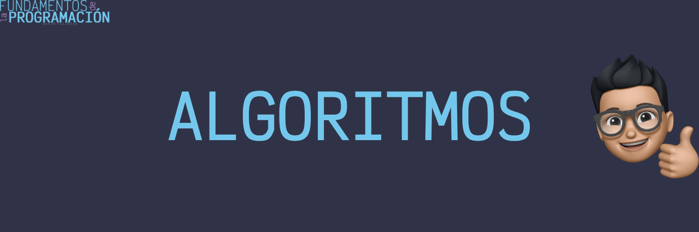

# Algoritmos

Un algoritmo en programación es una secuencia finita de instrucciones bien definidas, ordenadas y claras, diseñadas para resolver un problema o realizar una tarea específica. Es, en esencia, un procedimiento paso a paso que guía a una computadora para llevar a cabo un cálculo o proceso.

## Características de los algoritmos

- **Finito**: Un algoritmo debe finalizar después de un número finito de pasos. No debe entrar en un bucle infinito o continuar indefinidamente.

- **Definido**: Cada paso del algoritmo debe ser preciso y no ambiguo. Debe estar claramente definido qué operación se debe realizar en cada paso.

- **Entrada**: Un algoritmo debe tener cero o más entradas, que son los valores iniciales o datos necesarios para realizar el cálculo.

- **Salida**: Un algoritmo debe tener una o más salidas, que son los resultados o soluciones que se obtienen después de ejecutar el algoritmo.

- **Eficiente**: Un algoritmo debe ser eficiente, es decir, debe resolver el problema en un tiempo razonable y utilizando la menor cantidad de recursos posibles.

## importancia en la programación

Los algoritmos son fundamentales en la programación porque permiten a los programadores resolver problemas de manera sistemática y eficiente. Al diseñar un algoritmo, un programador puede dividir un problema complejo en pasos más simples y manejables, lo que facilita la implementación y depuración del código.

- Son la base de cualquier programa o aplicación informática.
- Permiten resolver problemas de manera sistemática y eficiente.
- Facilitan la implementación y depuración del código.
- Ayudan a mejorar la eficiencia y rendimiento de los programas.

## Tipos de algoritmos

Existen numerosos tipos de algoritmos, cada uno diseñado para resolver problemas específicos. Algunos de los tipos más comunes son:

- Algoritmos de búsqueda: utilizados para encontrar un elemento específico en una colección de datos.

- Algoritmos de ordenación: utilizados para ordenar una colección de datos en un orden específico.

- Algoritmos de grafos: utilizados para resolver problemas relacionados con grafos y redes.

- Algoritmos de recursividad: utilizados para resolver problemas de manera recursiva, es decir, dividiendo el problema en subproblemas más pequeños.

- Algoritmos de programación dinámica: utilizados para resolver problemas de optimización dividiendo el problema en subproblemas más pequeños y almacenando las soluciones de los subproblemas para evitar recalcularlas.

En conclusión, los algoritmos con la base de la programación y son esenciales para resolver problemas de manera eficiente y sistemática. Al dominar los conceptos y técnicas de diseño de algoritmos, los programadores pueden crear programas más eficientes y optimizados.

