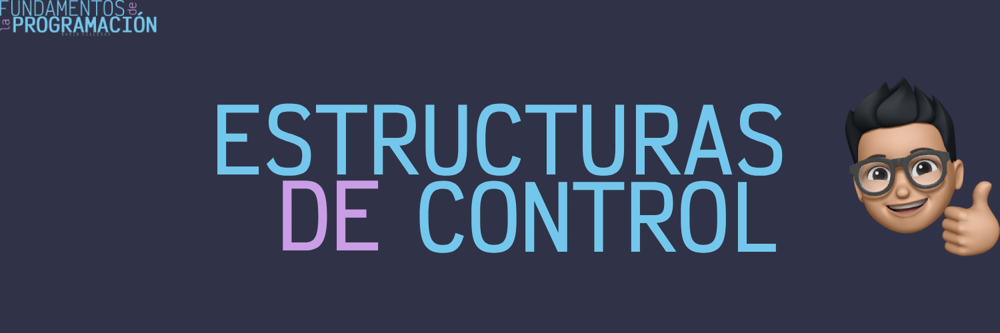

# Estructuras de control

Las estructuras de control son elementos fundamentales en cualquier lenguaje de programación, ya que permite modificar el flujo secuencial de ejecución de un programa. A través de estas construcciones sintácticas, los algoritmos adquieren la capacidad de tomar decisiones, repetir acciones y ejecutar bloques de código de manera condicional.

## Clasificación de las estructuras de control

Las estructuras de control se pueden clasificar en tres categorías principales:

### Secuenciales

Son aquellas en las que las instrucciones se ejecutan una tras otra, en el orden en que aparecen en el código. Es como una receta: cada paso se sigue en el orden indicado, sin saltos ni repeticiones, hasta llegar al final.

**Características principales**:

- Orden lineal: Las instrucciones se ejecutan en el orden en que aparecen en el código.

- Sin bifurcaciones: No se realizan saltos ni desvíos en la secuencia de ejecución.

- Sin repeticiones: Cada instrucción se ejecuta una sola vez.

**¿Cuándo usarlas?**:

- Cálculos simples: Cuando se trata de realizar una serie de operaciones en un orden específico.

- Inicializaciones: Cuando se requiere inicializar variables o estructuras de datos.

- Procesamiento de datos: Cuando se necesita procesar información de manera secuencial.

En resumen las estructuras de control secuenciales son el punto de partida de cualquier programa, ya que permiten establecer un flujo de ejecución básico y ordenado.

### Condicionales

Permiten evaluar una o más condiciones y, en función de su resultado, ejecutar un bloque de código u otro.

**¿Qué son las condiciones?**:

- Son expresiones que se evalúan como verdaderas o falsas.

- Se utilizan para tomar decisiones en función de ciertas circunstancias.

**Tipos de estructuras condicionales**:

- `if`: Permite ejecutar un bloque de código si se cumple una condición.

- `if-else`: Permite ejecutar un bloque de código si se cumple una condición y otro bloque si no se cumple.

- `if-else if-else`: Permite evaluar múltiples condiciones y ejecutar un bloque de código en función de la primera que se cumpla.

- `switch`: Permite evaluar una expresión y ejecutar un bloque de código en función de su valor.

**¿Cuándo usarlas?**:

- Validación de datos: Para verificar si los datos ingresados por el usuario son correctos.

- Toma de decisiones: Para ejecutar un bloque de código u otro en función de ciertas condiciones.

- Control de flujo: Para modificar el flujo de ejecución de un programa en función de ciertas circunstancias.

En resumen, las estructuras de control condicionales permiten tomar decisiones en función de ciertas condiciones, lo que las convierte en un elemento fundamental en la programación.
        

### Iterativas

Permiten repetir un bloque de código un número determinado de veces o mientras se cumpla una condición.

- **Tipos de estructuras iterativas**:

- `for`: Permite repetir un bloque de código un número determinado de veces.

- `while`: Permite repetir un bloque de código mientras se cumpla una condición.

- `do-while`: Permite repetir un bloque de código al menos una vez y mientras se cumpla una condición.

- **¿Cuándo usarlas?**:

- Procesamiento de datos: Para recorrer una lista de elementos y realizar una operación sobre cada uno de ellos.

- Búsqueda de información: Para buscar un elemento en una lista o estructura de datos.

- Validación de datos: Para verificar si los datos ingresados por el usuario son correctos.

En resumen, las estructuras de control iterativas permiten repetir un bloque de código un número determinado de veces o mientras se cumpla una condición, lo que las convierte en un elemento fundamental en la programación.