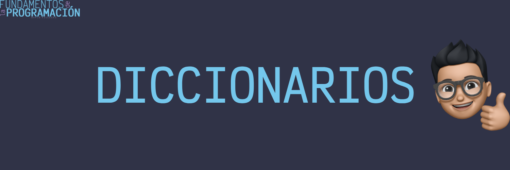

# Diccionarios

En programación un diccionario es una estructura de datos que permite almacenar una colección de elementos de forma desordenada, pero asociando cada elemento con una clave única. Cada elemento del diccionario se compone de dos partes: una clave y un valor, que se utilizan para identificar y acceder a los elementos de la colección.

## Características de los diccionarios

- **Asociación clave-valor**: Cada elemento del diccionario se compone de una clave única y un valor asociado.

- **Desordenados**: Los elementos de un diccionario no tienen un orden específico, es decir, no se garantiza el orden en que se almacenan.

- **Claves únicas**: Cada clave de un diccionario debe ser única, es decir, no puede haber dos elementos con la misma clave.

- **Mutabilidad**: Los elementos de un diccionario pueden ser modificados, es decir, se pueden cambiar su valor o su clave.

- **Heterogeneidad**: Los elementos de un diccionario pueden ser de diferentes tipos de datos, lo que permite almacenar información diversa en una misma estructura.

## Casos de uso de los diccionarios

- **Almacenamiento de información**: Los diccionarios son utilizados para almacenar información que se puede acceder de forma rápida mediante una clave.

- **Configuración de aplicaciones**: Los diccionarios son utilizados para almacenar configuraciones de aplicaciones, como opciones de usuario, preferencias, etc.

- **Procesamiento de datos**: Los diccionarios son utilizados para procesar y manipular información de forma eficiente, como la carga de datos, la generación de informes, etc.

## Operaciones con diccionarios

- **Agregar elementos**: Permite añadir un nuevo elemento al diccionario asociando una clave y un valor.

- **Eliminar elementos**: Permite eliminar un elemento del diccionario mediante su clave.

- **Buscar elementos**: Permite buscar un elemento en el diccionario mediante su clave y obtener su valor asociado.

- **Recorrer el diccionario**: Permite recorrer todos los elementos del diccionario y realizar una operación sobre cada uno de ellos.

- **Modificar elementos**: Permite cambiar el valor asociado a una clave específica en el diccionario.

### Conclusión

Los diccionarios son una estructura de datos fundamental en programación que permite almacenar y manipular información de forma eficiente. Al comprender cómo funcionan los diccionarios y cómo se pueden utilizar en diferentes situaciones, podrás escribir programas más eficientes y organizados.

