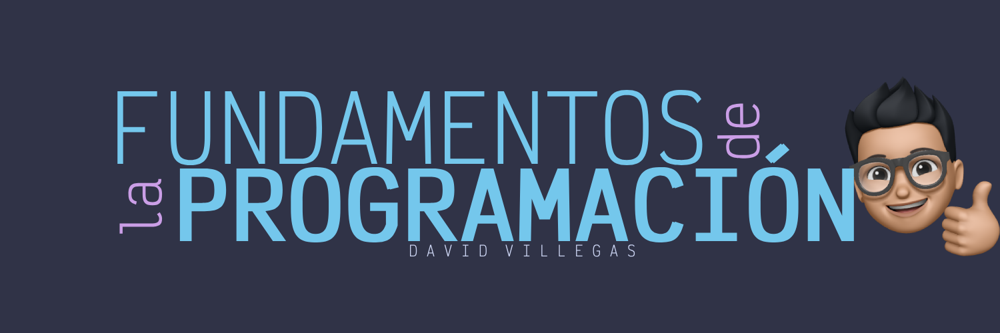

# Fundamentos de Programación

Una computadora es una máquina electrónica que puede ser programada para realizar una secuencia de operaciones aritméticas o lógicas automáticamente. 

**¿Qué significa esto?**

Imagina que una computadora como un cerebro artificial que sigue instrucciones muy precisas. Estas instrucciones, que nosotros llamamos código, son escritas en un lenguaje de programación que la máquina puede entender.

**Elementos clave de una computadora**

- **Hardware**: La parte física de la computadora, como el procesador, la memoria, el disco duro y periféricos (teclado, mouse, monitor).

- **Software**: Los programas que hacen funcionar la computadora, desde el sistema operativo hasta las aplicaciones que utilizamos a diario.

- **Sistema operativo**: El programa principal que gestiona el hardware y proporciona una interfaz para que los usuarios puedan interactuar con la computadora.

**¿Por qué es importante entender esto en programación?**

- **Para escribir código eficiente**: Al comprender cómo funciona una computadora, puedes escribir programas que aprovechen el máximo sus recursos.

- **Para solucionar problemas**: Si un programa no funciona como se espera, conocer los fundamentos de la computadora te ayudará a identificar y solucionar el problema.

- **Para desarrollar nuevas tecnologías**: Los programadores crean nuevas aplicaciones y software que hacen que las computadoras sean más útiles y poderosas.

En resumen, la computadora es la herramienta fundamental con la que trabajamos los programadores. Es a través de ella que podamos dar vida a nuestras ideas y crear soluciones a problemas del mundo real.

## Qué es la programación

La programación es un proceso fascinante que consiste en crear un conjunto de instrucciones detalladas que le indican a una computadora qué tareas debe realizar. Es como darle un recetario a una máquina, pero en lugar de cocinar, la computadora ejecuta esas instrucciones para lograr un objetivo específico.

**¿Para que sirve la programación?**

- **Crear software**: Desde simples aplicaciones móviles hasta complejos sistemas operativos, todo el software que usamos a diario es creado por programadores.

- **Automatizar tareas**: La programación permite automatizar tareas repetitivas, ahorrando tiempo y esfuerzo.

- **Resolver problemas**: Los programadores encuentran soluciones a problemas complejos a través de la lógica y la creatividad.

- **Innovar**: La programación es la base de la innovación tecnológica, permitiendo crear nuevas herramientas y productos.

**¿Cómo funciona?**

1. **Lenguajes de programación**: Los programadores utilizan lenguajes específicos para escribir código que la computadora pueda entender. (como Python, JavaScript, Java, C++, entre otros). Para escribir el código, que son las instrucciones que la computadora entenderá.

2. **Compiladores e intérpretes**: Estos programas traducen el código escrito en un lenguaje de alto nivel a un lenguaje máquina, que es el único que la computadora puede ejecutar directamente.

3. **Ejecución**: La computadora lee las instrucciones del código máquina y las ejecuta una por una, llevando a cabo la tarea programada.

**¿Por qué aprender a programar?**

- **Desarrolla el pensamiento lógico**: La programación te enseña a resolver problemas de manera estructurada y a pensar de forma algorítmica.

- **Abre puerta a nuevas oportunidades laborales**: La demanda de programadores está emn constante crecimiento.

- **Te permite crear tus propias soluciones**: Puedes desarrollar aplicaciones, juegos, sitios web y mucho más. 

- **Es divertido y gratificante**: Ver tus ideas cobrar vida en forma de software es una experiencia única y satisfactoria.

## Contenido

- [Tipos de lenguajes de programación](00_lenguajes_programacion.md)
- [Sintaxis y semántica](01_sintaxis_semantica.md)
- [Paradigmas de programación](02_paradigmas.md)
- [Algoritmos](03_algoritmos.md)
- [Estructuras de control](04_estructuras_control.md)
- [Funciones y procedimientos](05_funciones_procedimientos.md)
- [Variables](06_variables.md)
- [Tipos de datos](07_tipos_datos.md)
- [Operadores](08_operadores.md)
- [Arrays](09_arrays.md)
- [Listas](10_listas.md)
- [Diccionarios](11_diccionarios.md)
